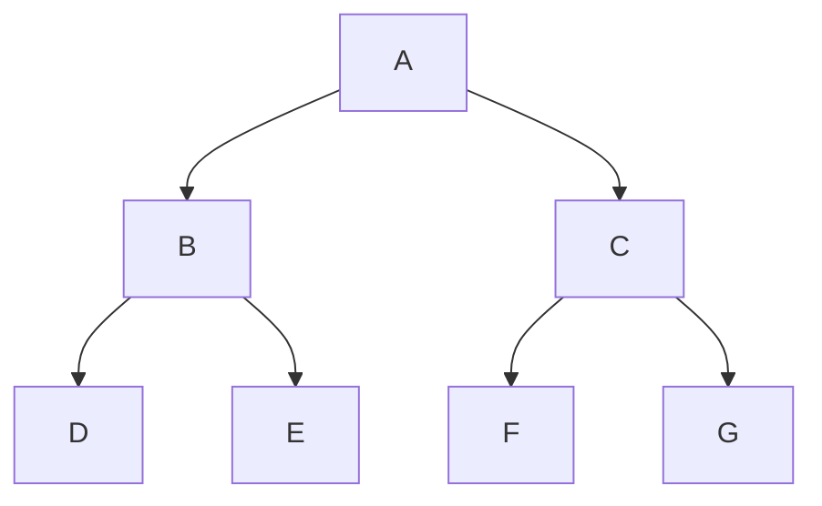

发现一个问题，解决一类问题 ——余承东

---


人是社会性动物


人需要外部反馈，即便是内部学习过程


凝聚，产生能量、创造价值


学习，输入再输出的过程，即知行合一


一个学习者，需要一个外部环境，提供好的学习环境、并获得安全感、归属感、方向感、精神支持


技术博客，凝聚相同专业&热爱技术的人，有利于营造一个学习氛围


“公共场所”，⟹线上⟹专业+平台，比如论坛⟹CSDN、博客园、GitHub等


#### 灵感

一个极其需要的“模型世界”，用于教学和理解、以及步骤演示

从0711文件，想到一个需求：动画：步骤逻辑+可视化

抽象模型动画软件

游戏制作软件中的各种模型的触发是如何实现的

数字孪生

逻辑。步骤过程的动画制作格式与软件

10款UI动效设计工具

https://airbnb.io/lottie/#/

---

制作一个软件，记录每条灵感的内容、分类、来源、日期

---

markdown的复选框 总是变成无序列表

---

设计一个更好的东西：几乎完全替代markdown

---

自动添加gettersetter的框架的名字

---

maven中央仓库https://mvnrepository.com/

这个是？https://central.sonatype.com/

---

git官网https://git-scm.com/

git fetch 是什么意思https://blog.csdn.net/m0_52364694/article/details/120118493


码云？todo gitee官网https://gitee.com/

---

font-family: 'Roboto Mono'

RobotoMono字体

---

atom

---

如何在github写技术博客

学习在github上编写技术文档

---

如何修改github的名字

github的actions功能 

---

markdown的主题

Typora下载并增加新的主题

typora主题下载

---

Visual Studio Code百度百科

https://code.visualstudio.com/docs

vscode 同步更改报错:未能对git remote 进行身份验证

---

### 测试题

Java类库中,将信息写入内存的类

以下结构中,插入性能最高的是

Microsoft SQL Server是


---

[并发编程之volatile原理与使用](https://blog.csdn.net/qq_29479041/article/details/84824853)

工作年限


## 工作任务

[java面试手册](file:///G:/%E9%87%8D%E6%96%B0%E5%AD%A6%E4%B9%A0java/2%E5%8E%9F(%E6%88%96%E8%A7%A3%E5%8E%8B%E5%90%8E%E7%9A%84)%E6%96%87%E4%BB%B6/20240529%E6%9D%A5%E8%87%AA%E6%9D%8E%E9%87%91%E7%87%95%E5%88%86%E4%BA%AB_Java%E9%9D%A2%E8%AF%95%E6%89%8B%E5%86%8C/Java%E9%9D%A2%E8%AF%95%E6%89%8B%E5%86%8C.pdf)

[大彬的GitHub](https://github.com/Tyson0314/Java-learning)

[大彬的个人网站](https://topjavaer.cn/)


#### 找工作、话术

求职时,别人问您考虑这份工作吗?怎么简短回复肯定

怎么表达我对这份工作很有意愿。

专业英语等级有哪些

crm是什么意思

---

全民简历官网

---

[爱企查：深圳市易立德信息科技有限公司](https://aiqicha.baidu.com/company_detail_34354433336408)


---

[学信网](https://my.chsi.com.cn/archive/index.jsp)

[专升本学历编号和学位编号一样吗](https://baijiahao.baidu.com/s?id=1788296095287875824&wfr=spider&for=pc)

---

书名的英文用什么单词:title

图书馆管理员 英语librarian

出版年份 英文

year of publication

---

[图书管理系统的实现](https://blog.csdn.net/qq_61141142/article/details/136407482)

bugfree是什么意思


---

学如逆水行舟,不进则退;心似平原走马,易放难收


非递归方式

queue 队列


在IntelliJ IDEA中，‌查看类的成员（‌包括方法、‌属性、‌内部类等）‌的窗口可以通过以下快捷键进行操作：‌

- **Ctrl+F12**：‌浮动显示当前文件的结构。‌这个快捷键会直接显示当前类中的所有成员列表，‌支持搜索功能，‌可以快速定位到某个成员的位置。‌
- **Alt+7**：‌显示当前类的所有成员。‌这个快捷键会显示当前类的继承关系，‌同时支持搜索功能，‌可以快速定位到某个成员的位置。‌

这两个快捷键都提供了便捷的方式来查看和导航到类的成员。‌使用`Ctrl+F12`可以获得一个浮动窗口，‌展示当前类的所有成员，‌而`Alt+7`则提供了一个更详细的继承关系图，‌帮助理解类的结构12。‌


##### [idea查看类的继承关系](http://www.baidu.com/link?url=er8UV8TsPpbMCAg2eFdSs_Q--q3IT58w6ksKQXoIRLY-ew_kyYhv5zhNoAVYFdmcBmxZ2AhpwkvTPufRU9fSbhgYaPBbM774maeEhcDr0dW8cezRJvrTGXhiVU8KghBZMRNlLH85R8SUcQj4i1MyLfT74chIRfDukZGcOpGGIBn_eQGz5aaAlt2Aij6-sP-Z4NMp6hp-ebvV65o4v_gGElhr2WjWPGV6lFsJoUh4kffQsieup8Uayl_dtsvewjQx9SAz2M2tlRypMXvtny0HiquzJVIFSBMv6iEwvkD7E0GFwOwD6E0E0iwGLyH64tz4Pz20izJXIJYHgCGUod8BWJ6Bbf_7vXF7hAUaLgkHt1Hy00jpn41olCMVFKOGkyYeznLIdf52e8NFVZgFiJVGMdSmMYJ9LHeeAmZ5CvCByximAJcx4mc0svXt9S2BSzzLwmTpgRauGvdFA7VHYUBZvMOfosmktsHtva02u6ImQzG_XAetSKD9I2yxCcf3oh7VvfTG_U_zOXEFe8XGH01Y9NhjfDgaVvbDQHWegUWMFiMvbWaYMRf8Xvb1fu4KjWAH)

在[IntelliJ IDEA**](https://www.baidu.com/s?tn=51076811_dg&wd=IntelliJ IDEA&usm=1&ie=utf-8&rsv_pq=f36bb22b00743926&oq=idea查看类的继承关系&rsv_t=b3d2fY1yGSvlQCB2PH0aL2cDNg%2Fu3akL10D3xD0%2BFyZeHHLVHoqUcp5D0FvelLbTotw&sa=re_dqa_zy&icon=1)中查看类的继承关系，可以通过以下几种方法实现：12

1. **使用快捷键**：在类名上使用`Ctrl+H`可以查看类的继承关系。此外，还可以通过`Ctrl+Alt+Shift+U`直接到达弹出页面选择Java Class Diagrams来查看当前类的所有父节点和子节点。通过这种方式，你可以直观地看到类的继承层次结构和关系。
2. **导出[UML图\*\*](https://www.baidu.com/s?tn=51076811_dg&wd=UML图&usm=1&ie=utf-8&rsv_pq=f36bb22b00743926&oq=idea查看类的继承关系&rsv_t=63bdDYYkDpYMUmESH58rAniApYcXBHP6DZWJ8FRZyqP6HvFRiybP9KEQcES3Oye69Ro&sa=re_dqa_zy&icon=1)**：如果你想要以图形化的方式查看和理解类的继承关系，IDEA还支持导出UML图。通过选择左侧栏的`structure`功能，你可以查看该类中的所有方法，并且可以通过`Export to Image File...`或`Export to Text File`导出继承关系为UML图或文本文件。
3. **优化和自定义继承关系图**：IDEA允许你优化和自定义继承关系图，以便更好地展示你关心的类。你可以去掉不相关的类，展示类的详细信息，如属性、方法和构造方法等。此外，你还可以调整方法的可见性级别，以及通过放大镜功能放大图形以便更清晰地查看。
4. **查看具体代码**：如果你对某个方法的具体源码感兴趣，可以通过IDEA提供的structure功能或直接双击类名后，在方法列表中游走，选择想要查看的方法，然后使用`Jump to Source`功能快速定位到源码。

通过上述方法，你可以在IntelliJ IDEA中有效地查看、理解和分析类的继承关系，从而更好地掌握代码的结构和设计。

##### java类库中,已有的栈的实现类被废弃了

在Java中，‌`Stack`类曾经是一个常用的类，‌用于实现栈这种后进先出（‌LIFO）‌的数据结构。‌然而，‌从Java 1.2版本开始，‌`Stack`类就被标记为过时（‌deprecated）‌，‌不再推荐使用。‌这是因为`Stack`类存在一些问题，‌使得它在现代Java开发中不再是一个好的选择。‌

- **并发访问问题**：‌`Stack`类是基于`Vector`类实现的，‌继承了`Vector`类的所有方法，‌包括一些不太安全的方法，‌如`addElement`和`elementAt`。‌这些方法可能导致并发访问的问题，‌因为它们没有提供任何同步机制。‌在多线程环境下使用`Stack`类可能会导致数据不一致或竞态条件的发生。‌
- **性能问题**：‌由于`Stack`类是基于`Vector`类实现的，‌它也会继承`Vector`类的线程安全性。‌这意味着在执行同步操作时，‌会有一定的性能损耗。‌如果只需要一个简单的栈数据结构，‌使用`Stack`类可能会浪费一些资源。‌
- **替代方案**：‌尽管`Stack`类被废弃了，‌但仍然可以使用其他的替代方案来实现栈的功能。‌在Java中，‌最好的替代方案是使用`LinkedList`类。‌`LinkedList`类也实现了`List`接口，‌但提供了一些栈操作方法，‌如`push`、‌`pop`和`peek`等，‌这些方法足以满足栈的基本操作需求。‌

综上所述，‌虽然Java曾经提供了一个用于实现栈的类，‌但由于其存在的问题和更好的替代方案的出现，‌建议不再使用已被废弃的`Stack`类，‌而是选择使用`LinkedList`类来实现栈的功能1。‌


java类库中,已有的二叉树实现类

在Java类库中，已经存在实现二叉树的类，例如`java.util.TreeMap`和`java.util.TreeSet`，但它们并不直接对应二叉树的实现。Java中通常使用`java.util.HashMap`来实现二叉树，因为它允许我们以O(log n)时间复杂度进行插入、删除和查找操作。

如果你想要一个更加专门的二叉树实现，你可以考虑使用第三方库，例如Apache Commons Collections提供的`org.apache.commons.collections4.BidiMap`接口，或者使用Google Guava库中的`com.google.common.collect.TreeBasedTable`。

以下是一个简单的二叉树节点定义和一个插入操作的例子：

```
```

这个简单的二叉树实现使用了一个`HashMap`来存储节点的引用，并通过节点类内部定义了左右子节点。`insert`方法用于插入新的节点，它遵循二叉搜索树的插入逻辑。


java类库中,已有的栈的实现类

在Java类库中，已经存在一个标准的栈实现类，它就是`Stack`类。`Stack`类是Java集合框架的一部分，继承自`Vector`类，提供了实现栈所需的所有功能。

以下是使用`Stack`类的一个简单示例：

```java
import java.util.Stack;
 
public class StackExample {
    public static void main(String[] args) {
        Stack<String> stack = new Stack<>();
 
        // 操作栈
        stack.push("元素1");
        stack.push("元素2");
        stack.push("元素3");
 
        System.out.println("栈顶元素: " + stack.peek());
 
        // 查看栈中的元素
        while (!stack.empty()) {
            System.out.println(stack.pop()); // 弹出元素并打印
        }
    }
}
```

在这个例子中，我们创建了一个`Stack<String>`对象，然后使用`push`方法向栈中添加了三个字符串元素。使用`peek`方法查看了栈顶的元素，并使用`pop`方法移除并打印了栈顶的元素，直到栈为空。这就是`Stack`类的基本使用。


java 二叉树 遍历 非递归 代码

在Java中，二叉树的遍历通常可以通过递归和迭代两种方式实现。下面是使用迭代方式（即非递归）遍历二叉树的代码示例：

```java
class TreeNode {
    int val;
    TreeNode left;
    TreeNode right;
    TreeNode(int x) {
        val = x;
    }
}
 
public class BinaryTreeTraversal {
 
    // 使用队列进行遍历
    public List<Integer> traverse(TreeNode root) {
        List<Integer> result = new ArrayList<>();
        Queue<TreeNode> queue = new LinkedList<>();
        queue.offer(root);
 
        while (!queue.isEmpty()) {
            TreeNode node = queue.poll();
            if (node != null) {
                result.add(node.val);
                queue.offer(node.left);
                queue.offer(node.right);
            }
        }
 
        return result;
    }
 
    public static void main(String[] args) {
        // 示例二叉树：
        //      1
        //     / \
        //    2   3
        //   / \   \
        //  4   5   6
        TreeNode root = new TreeNode(1);
        root.left = new TreeNode(2);
        root.right = new TreeNode(3);
        root.left.left = new TreeNode(4);
        root.left.right = new TreeNode(5);
        root.right.right = new TreeNode(6);
 
        BinaryTreeTraversal traversal = new BinaryTreeTraversal();
        List<Integer> traversalOrder = traversal.traverse(root);
        System.out.println(traversalOrder); // 输出二叉树的遍历结果
    }
}
```

这段代码定义了一个二叉树节点类`TreeNode`和一个二叉树遍历类`BinaryTreeTraversal`。`traverse`方法使用了一个队列来实现非递归的层次遍历二叉树。它首先将根节点加入队列，然后在一个循环中反复 poll 出队列的头节点，并将该节点的左右子节点（如果存在）加入队列。这样就可以按层次遍历整棵二叉树，并且输出每个节点的值。


java的栈的实现类

在Java中，`Stack` 类已经作为 `java.util.Stack` 被废弃，不推荐使用。但如果你想要实现一个简单的栈，可以参考以下代码：

```java
public class MyStack<T> {
    private int size;
    private T[] data;
 
    public MyStack(int initialCapacity) {
        this.size = 0;
        this.data = (T[]) new Object[initialCapacity];
    }
 
    public MyStack() {
        this(10); // 默认容量为10
    }
 
    public void push(T element) {
        ensureCapacity();
        data[size++] = element;
    }
 
    public T pop() {
        if (size == 0) {
            return null;
        }
        T element = data[size - 1];
        data[--size] = null; // 释放对象引用
        return element;
    }
 
    public T peek() {
        if (size == 0) {
            return null;
        }
        return data[size - 1];
    }
 
    public boolean isEmpty() {
        return size == 0;
    }
 
    private void ensureCapacity() {
        if (size >= data.length) {
            data = Arrays.copyOf(data, data.length * 2); // 扩容
        }
    }
}
```

使用示例：

```java
MyStack<Integer> stack = new MyStack<>();
stack.push(1);
stack.push(2);
stack.push(3);
 
System.out.println(stack.pop()); // 输出3
System.out.println(stack.peek()); // 输出2
```

这个简单的栈实现有基本的推入、弹出和查看栈顶元素的功能。它使用了泛型来支持任何类型的元素。注意，这个实现没有考虑线程安全问题。


##### java的二叉树实现类

以下是一个简单的Java二叉树实现类的示例代码：

这个类实现了一个二叉树，并提供了插入节点和中序遍历的方法。在`main`方法中，我们创建了一个二叉树并插入了一些值，然后进行中序遍历，输出结果将是按照从小到大的顺序排列的树中的值。


https://chat.baidu.com/page/pluginhome.html


什么是.WOFF2 文件？ WOFF2 是**一种字体文件格式，是Web 开放字体格式(WOFF) 的压缩程度更高的版本**。 它被开发为一种减小网络字体文件大小的方法，使它们能够更快地加载并使用更少的带宽。 WOFF2 使用称为Brotli 的压缩算法来压缩字体数据，这可能导致文件大小明显小于等效的WOFF 字体。


下载好，各种常见JDK版本：比如jdk21-windows。从Oracle官网上学习一些示例Java代码，doc等


narrow down on typing：键入时，动态地缩小显示范围。

+ narrow down：通过去除最不重要、不必要或不合适的事物，使得一系列事物的数量或列表变小

Alphabetically：adv. 照字母顺序排列地


markdown中,画二叉树

mermaid官网：https://mermaid.nodejs.cn/


#### 二叉树的遍历

从根节点出发，按照某种次序依次访问二叉树中的所有节点，使每个节点被且仅被访问一次

是父节点相对于子节点来说的.父节点先于子节点;子节点先于父节点;先左节点，然后是父节点，然后再是右节点

```
     A
    / \
   B   C
  / \ / \
 D  E F  G
```


先序遍历: A->B->D->E->C->F->G

中序遍历: D->B->E->A->F->C->G

后续遍历: D->E->B->F->G->C->A

```java
```


##### 先序遍历

##### 中序遍历

##### 后续遍历





